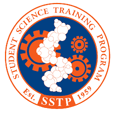

<!--
*** Thanks for checking out this README Template. If you have a suggestion that would
*** make this better, please fork the repo and create a pull request or simply open
*** an issue with the tag "enhancement".
*** Thanks again! Now go create something AMAZING! :D
***
***
***
*** To avoid retyping too much info. Do a search and replace for the following:
*** tylertaewook, project-orbitron, alitecraft, taewook.kim@columbia.edu
-->

<!-- PROJECT SHIELDS -->
<!--
*** I'm using markdown "reference style" links for readability.
*** Reference links are enclosed in brackets [ ] instead of parentheses ( ).
*** See the bottom of this document for the declaration of the reference variables
*** for contributors-url, forks-url, etc. This is an optional, concise syntax you may use.
*** https://www.markdownguide.org/basic-syntax/#reference-style-links
-->

<!-- PROJECT LOGO -->
 

  

  <h3 align="center">Histogram Layer for Texture Classification</h3>

  

    ML texture analysis research in 2019 UF SSTP
  

      June 2019 – August 2019
     
    <a href="https://github.com/tylertaewook/project-orbitron"><strong>Explore the docs »</strong></a>
     
     
    <a href="https://github.com/tylertaewook/project-orbitron">View Demo</a>
    ·
    <a href="https://github.com/tylertaewook/project-orbitron/issues">Report Bug</a>
    ·
    <a href="https://github.com/tylertaewook/project-orbitron/issues">Request Feature</a>
  

<!-- TABLE OF CONTENTS -->
## Table of Contents

* [About the Project](#about-the-project)
  * [UF SSTP](#uf-sstp)
  * [Research](#research)
* [Contact](#contact)
* [Acknowledgements](#acknowledgements)

<!-- ABOUT THE PROJECT -->
## About The Project

ML texture analysis research in 2019 UF SSTP that implements deep network models in PyTorch for texture analysis applications.

<!-- UF SSTP -->
### UF SSTP

"[The University of Florida Student Science Training Program (UF SSTP)](https://www.cpet.ufl.edu/students/uf-cpet-summer-programs/student-science-training-program/) is a seven week residential research program for selected students entering senior year. The program emphasis is research participation with a UF faculty research scientist and his or her research team."

"Students engage in the ongoing research of the faculty-mentor for 30 hours each week, attend a daily lecture series on current research topics, and participate in a UF honors seminar class.  Additionally, students develop important interpersonal, leadership, professional communication, and organizational skills through academic, social, and service activities." (Extracted from SSTP website's descriptions)

<!-- RESEARCH -->
### Research

As this was an on-going research, we cannot publish the code under SSTP's research security agreement.

<!-- CONTACT -->
## Contact

Tyler Kim - taewook.kim@columbia.edu

Project Link: [https://github.com/tylertaewook/project-orbitron](https://github.com/tylertaewook/project-orbitron)

<!-- ACKNOWLEDGEMENTS -->
## Acknowledgements

* 
* 
* 

<!-- MARKDOWN LINKS & IMAGES -->
<!-- https://www.markdownguide.org/basic-syntax/#reference-style-links -->
[contributors-shield]: https://img.shields.io/github/contributors/tylertaewook/repo.svg?style=flat-square
[contributors-url]: https://github.com/tylertaewook/repo/graphs/contributors
[forks-shield]: https://img.shields.io/github/forks/tylertaewook/repo.svg?style=flat-square
[forks-url]: https://github.com/tylertaewook/repo/network/members
[stars-shield]: https://img.shields.io/github/stars/tylertaewook/repo.svg?style=flat-square
[stars-url]: https://github.com/tylertaewook/repo/stargazers
[issues-shield]: https://img.shields.io/github/issues/tylertaewook/repo.svg?style=flat-square
[issues-url]: https://github.com/tylertaewook/repo/issues
[license-shield]: https://img.shields.io/github/license/tylertaewook/repo.svg?style=flat-square
[license-url]: https://github.com/tylertaewook/repo/blob/master/LICENSE.txt
[linkedin-shield]: https://img.shields.io/badge/-LinkedIn-black.svg?style=flat-square&logo=linkedin&colorB=555
[linkedin-url]: https://linkedin.com/in/tylertaewook
[product-screenshot]: images/screenshot.png
